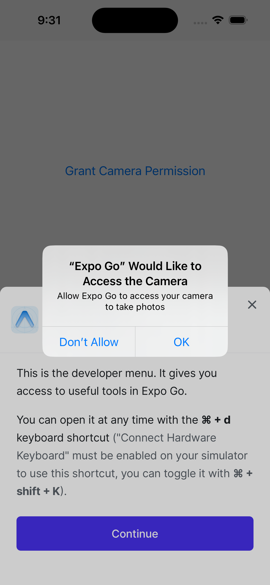
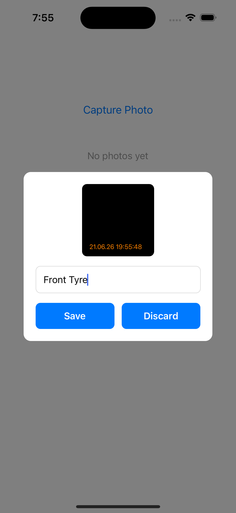
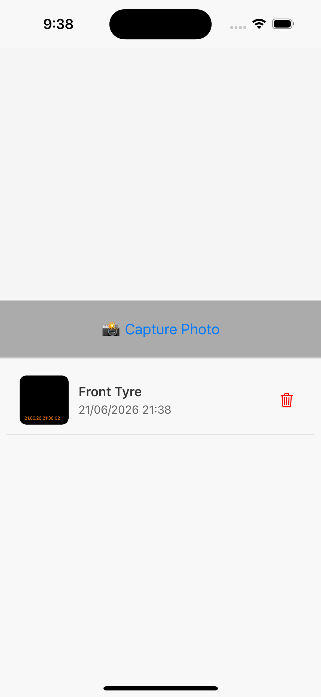
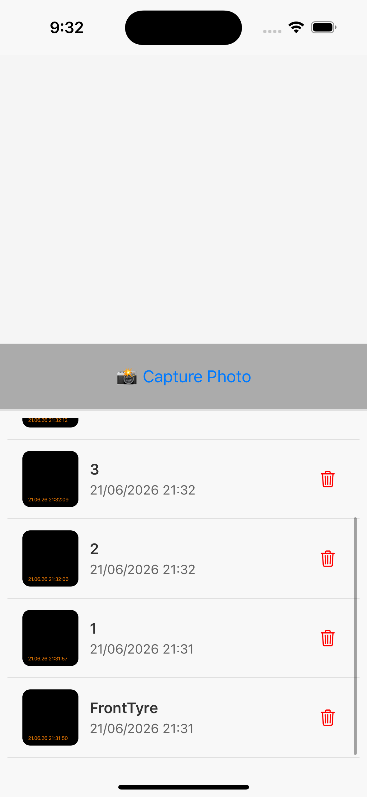

# Field Inspection

An offline-first mobile app for capturing, labeling, and managing field inspection photos with audit-grade timestamp accuracy and persistent local storage.

## Quick Start

```bash
# Install dependencies
npm install

# Start dev server
npx expo start

# Scan QR code with Expo Go (iOS/Android)
```

## Tech Stack

- **Framework:** Expo 54 (React Native 0.81.5)
- **Database:** SQLite (expo-sqlite 16.0.10)
- **File System:** Expo FileSystem (legacy API)
- **Camera:** expo-camera 17.0.10
- **Cryptography:** expo-crypto 15.0.9 (UUID generation)

---

## Features

### Core Capabilities
- 📸 **Photo Capture:** Live camera preview with timestamp at capture moment
- 🏷️ **Photo Labeling:** Required labels for each photo
- 💾 **Persistent Storage:** SQLite database + FileSystem for reliable persistence
- 📋 **Photo Gallery:** Scrollable list with thumbnails, labels, and timestamps
- 🗑️ **Photo Management:** Delete individual photos (both database and file)
- 📱 **Fully Offline:** No internet required; all data stored locally

### Data Reliability
- **Atomic Operations:** Database and file deletion are synchronized
- **Type Safety:** 100% TypeScript with strict mode
- **Structured Errors:** Specific error types with user-friendly messages
- **Audit Trail:** Timestamps reflect exact moment of capture (not save time)

---

## Screenshots

### Camera Capture Screen

- Live camera preview with 150px fixed height
- Capture button centered below preview
- Real-time photo capture

### Label Modal

- Photo thumbnail preview (120x120)
- Required label input field
- Save and Discard buttons
- Validation (Save button disabled when empty)

### Photo Gallery (Single Photo)

- First photo saved with label and timestamp
- Thumbnail (60x60), label, and timestamp visible
- Delete button (trash icon) on far right

### Photo Gallery (Multiple Photos)

- Scrollable FlatList with multiple photos
- Shows app working with many captures
- Each photo displays thumbnail, unique label, and timestamp
- Delete buttons available for each photo

---

## Demo Video

**60-second walkthrough of complete flow:**

[](https://github.com/user-attachments/assets/0211ef93-4c3a-47a1-b8f2-89c6302e58c8)

[📹 View in Release](https://github.com/MadavaramRamesh/FieldInspection/releases/tag/pre_release)

Shows: Camera capture → Label entry → Save → Photo appears in list → Delete functionality

---

## Architecture

### System Design
The app uses a **layered architecture** for maintainability and scalability:

```
Components (UI Layer)
    ↓
Custom Hooks (State Management)
    ↓
Services (Business Logic)
    ↓
Database / FileSystem (Data Layer)
```

### Key Services
- **PhotoService** - CRUD operations, validation, business rules
- **StorageService** - FileSystem abstraction and photo management
- **CaptureOrchestrator** - Coordinates capture → label → save flow

### Custom Hooks
- **usePhotoCapture** - Capture state and UUID generation
- **usePhotoStorage** - Save/delete with error handling
- **usePhotoList** - List initialization and state management
- **usePhotoModal** - Modal visibility state

### Error Handling
- Structured error types with specific codes
- User-friendly error messages for UI
- Detailed context logging for debugging

---

## Storage & Persistence

### SQLite Database
Photos stored in SQLite with schema:
```sql
CREATE TABLE photos (
  id TEXT PRIMARY KEY,
  localPath TEXT NOT NULL,
  capturedAt TEXT NOT NULL,
  label TEXT NOT NULL
);
```

**Why SQLite over AsyncStorage?**
- Structured queries (ORDER BY, WHERE)
- Atomic operations (DELETE WHERE)
- Scales efficiently to 10K+ photos
- Schema validation

### File System
Photos stored in `FileSystem.documentDirectory/photos/`
- Persistent across app updates
- Not deleted on app uninstall
- Atomic deletion with database

---

## Timestamp Design

**Critical:** `capturedAt` is recorded **immediately after photo capture**, not when labeled or saved.

Why this matters:
- ✅ Legal/audit requirement - timestamp reflects actual capture moment
- ✅ Prevents tampering - timestamp is immutable once set
- ✅ Accurate ordering - chronological order guaranteed
- ✅ Offline-first - device time is authoritative source

---

## File Structure

```
src/
  types/              # Data contracts (CapturedPhoto interface)
  errors/             # Error types (PhotoError, error codes)
  services/           # Business logic (PhotoService, StorageService, etc.)
  hooks/              # Reusable state logic
  components/         # UI only (CameraView, LabelModal, PhotoList)
  db/                 # Database operations
  utils/              # Pure functions (formatDate)
  constants/          # App configuration

ARCHITECTURE.md       # Complete system design
TEAM_STANDARDS.md     # Coding standards and team guidelines
```

---

## Documentation

### Complete Documentation
- [ARCHITECTURE.md](./ARCHITECTURE.md) - Full system design, data flows, scalability
- [TEAM_STANDARDS.md](./TEAM_STANDARDS.md) - Coding standards, patterns, PR checklist

---

## Code Standards

The team follows strict standards for consistency and quality:

**Key Rules:**
- No business logic in components
- All async calls through services
- All errors typed and handled
- TypeScript strict mode enforced
- Components < 100 lines, Hooks < 50 lines

See [TEAM_STANDARDS.md](./TEAM_STANDARDS.md) for complete guidelines.

---

## How to Add a Feature

1. **Add business logic to a service** (PhotoService, etc.)
2. **Wrap in a hook** (usePhotoCapture, etc.) if reusable
3. **Use hook in component** (CameraView, etc.)
4. **Follow naming conventions** (Services, Hooks, Components patterns)
5. **Handle errors properly** (typed PhotoError)
6. **Write tests** (service tests, hook tests)

Example in [TEAM_STANDARDS.md](./TEAM_STANDARDS.md).

---

## Performance

### Current Capacity
- ✅ Handles 100-500 photos efficiently
- ✅ FlatList virtualization (only visible items rendered)
- ✅ Minimal memory footprint

### Scaling Path
- **500-5K photos:** Add pagination
- **5K-50K photos:** Add database indexing, filtering UI
- **50K+ photos:** Archive old sessions to cloud

See [ARCHITECTURE.md](./ARCHITECTURE.md) for detailed scalability notes.

---

## Security

### Data Storage
- All photos stored locally in `FileSystem.documentDirectory`
- Device OS handles encryption (iOS Keychain / Android Keystore)
- No data transmitted without explicit sync feature

### Permissions
- Camera permission validated at runtime
- Users can revoke in device settings
- Graceful handling of permission denial

---

## Contributing

When contributing:
1. Read [ARCHITECTURE.md](./ARCHITECTURE.md)
2. Follow patterns in [TEAM_STANDARDS.md](./TEAM_STANDARDS.md)
3. Write tests for services/hooks
4. Check code review checklist
5. Create ADR for architectural decisions

---

## Future Roadmap

### Phase 1: Offline Capture ✅
Photo capture with timestamps, labeling, persistence

### Phase 2: GPS Tagging
Capture coordinates at photo time, location display, map view

### Phase 3: Offline Sync Queue
Queue photos for server upload, automatic retry, compression

### Phase 4: Inspection Sessions
Group photos by session, metadata, session export

### Phase 5: Analytics & Reporting
Trends, metrics, export to PDF/CSV

### Phase 6: Team Workflows
Multi-user collaboration, approvals, comments

---

## License

[Add your license here]
